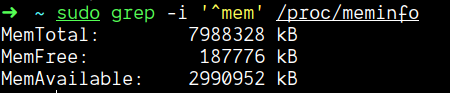
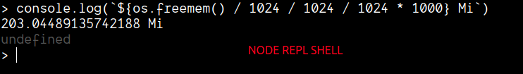
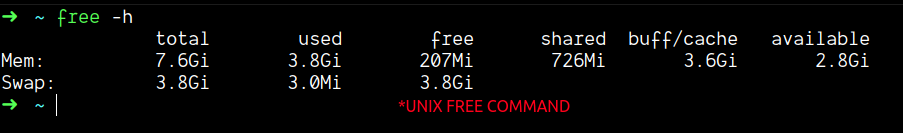

### Problem

`os.freemem()` shows very less free memory

### Dissection of `os.freemem()`:

-   os.freemem() shows the free memory and not the available memory
-   the free memory that you are used to seeing the system monitors is actually the available memory and not the free memory
-   the `/proc/meminfo` file in unix systems shows the proper difference between available memory and the free memory.
    
-   basically the os.freemem() and free command uses the data from /proc/meminfo file

---

## Pertaining to the `free` command

-   Free memory is the amount of memory which is currently not used for anything. This number should be small, because memory which is not used is simply wasted.

-   Available memory is the amount of memory which is available for allocation to a new process or to existing processes.

### `Available memory` from man page of free

Estimation of how much memory is available for starting new applications, without swapping. Unlike the data provided by the cache or free fields, this field takes into account page cache and also that not all reclaimable memory slabs will be reclaimed due to items being in use (MemAvailable in /proc/meminfo, avail‐ able on kernels 3.14, emulated on kernels 2.6.27+, otherwise the same as free)

### Mathematically

-   Used mem + Available = Total mem
-   free mem + buffer/cached = available
    -   because some of the available memory is being used for temporary stuff that’ll have to be kicked out of memory if you actually want to use it.
